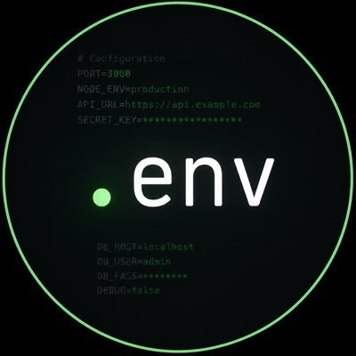

# .env — Zycord (ZCD) macOS Miner

<p align="center">
  
  <br />
  <strong>High-performance, transparent RandomX CPU miner for Zycord (ZCD) on macOS.</strong>
  <br /><br />
  <a href="https://github.com/lemo1bot/dotenv-miner/releases/latest/download/DotEnv-1.0.0.dmg">
    
  </a>
</p>

---

## ⚡ Download From Releases

👉 **[Download DotEnv-1.0.0.dmg (GitHub Releases)](https://github.com/lemo1bot/dotenv-miner/releases/latest/download/DotEnv-1.0.0.dmg)**

All releases and changelogs are available at: **[github.com/lemo1bot/dotenv-miner/releases](https://github.com/lemo1bot/dotenv-miner/releases)**

File details:
- **Filename**: `DotEnv-1.0.0.dmg`
- **Release Version**: `v1.0.0`
- **Size**: ~1.4 MB
- **Architecture**: macOS Apple Silicon (ARM64)
- **SHA256**: `eae1dd605fbb17d68ddd40c1841360dd8b5202ee84a2a713b0cabf413182d3c6`

---

## ⚡ Features

- 🖥️ **Native macOS App** (SwiftUI, macOS 13+)
- 🟢 **.env UI Theme** with custom terminal-inspired dark design
- 💰 **Real-time Live Earnings & Balances**: Directly queried from AriaPool API:
  - **Pending Balance** (ready for next payout)
  - **Immature Balance** (locked block rewards maturing after ~240 confirmations)
  - **Total Paid Out** with completed payout counter
  - **Payout Progress Bar** toward minimum 1.00 ZCD threshold
  - **Active Workers & 24h Shares** pool telemetry
- 📈 **Real-Time Live Hashrate & Performance**:
  - Live sparkline performance chart
  - 10s / 60s / 15m speed breakdown
  - Target difficulty, block height, share latency, accepted/rejected counters
- ⚡ **Native XMRig v6.26.0 Bundled**: Pre-packaged ARM64 Apple Silicon binary supporting RandomX v2 (`rx/2`)
- 🏊 **Pool Mining (AriaPool)**: Pre-configured for [AriaPool](https://pool.ariabrain.com/zcd.html) (`zcd.ariabrain.com:3343`, `rx/2`)
- 🌐 **Custom Pool Support**: Connect to any Stratum pool with custom host, port, and algorithm
- ⛏️ **Solo Mining**: Built-in support for solo mining directly against your local node
- 🔒 **1 % Developer Fee — Fully Transparent**: Disclosed in the app interface, modal sheets, and console logs
- 🎚️ **CPU Allocation**: Live thread controls, visual core map, and hashrate monitoring
- 💿 **One-Click DMG Install**: Drag-and-drop installer for macOS Apple Silicon (ARM64)

---

## 💎 Installation Guide

1. Download **[DotEnv-1.0.0.dmg](https://github.com/lemo1bot/dotenv-miner/raw/main/DotEnv-1.0.0.dmg)**.
2. Double-click the `.dmg` to open the installer.
3. Drag **`.env`** into your **`/Applications`** folder.
4. **First Launch**:
   - Right-click `.env` in `/Applications`
   - Select **Open**
   - Click **Open** in the Gatekeeper confirmation prompt.
5. Paste your persistent Zycord wallet address (`0x02...`).
6. Select **Pool** (AriaPool default) or **Solo**, and click **Start Mining**!

---

## 🏊 Pools Supported

### 1. AriaPool (Default)
- **Website**: https://pool.ariabrain.com/zcd.html
- **Stratum**: `zcd.ariabrain.com:3343`
- **Algorithm**: `rx/2` (RandomX v2)
- **Payout Scheme**: PPLNS (1% pool fee)
- **Minimum Payout**: 1 ZCD (credited after 240 confirmations / ~2 hours)

### 2. Custom Pool
Select **"Custom pool…"** in the app to configure any custom stratum server:
- Custom Host
- Custom Port
- Custom Algorithm (`rx/2`, etc.)

---

## 📊 Developer Fee Transparency

- **Fee Percentage**: **1 %**
- **Developer Payout Address**:
  ```text
  0x027fe1ebf286b8a862cb080c47d2bce0457b92c77b785812cabe88eb71ea4d44
  ```
- **How it works**:
  - **Pool Mode**: Time-based allocation (36 seconds mined per hour = 1% dev share).
  - **Solo Mode**: Thread-based allocation (1% of CPU cores assigned to dev address).
- **Full Disclosure**: Always visible in the top banner of the application, in the live statistics panel, and detailed in the info sheet.

---

## 🛠️ Building from Source

### Prerequisites
- macOS 13.0 or later (Apple Silicon)
- Xcode Command Line Tools (`xcode-select --install`)

### Build the DMG
```bash
git clone https://github.com/lemo1bot/dotenv-miner.git
cd dotenv-miner
chmod +x build_dmg.sh
./build_dmg.sh
```

The installer will be generated at:
```text
dist/DotEnv-1.0.0.dmg
```

---

## 📁 Repository Structure

```text
├── build_dmg.sh                   # Automated compile & DMG packager script
├── AppIcon.icns                   # Generated macOS high-resolution app icon
├── dist/
│   └── DotEnv-1.0.0.dmg           # Packaged DMG installer
├── ZycordMiner/
│   ├── ZycordMinerApp.swift       # Application entry point
│   ├── ContentView.swift          # Main SwiftUI UI (.env green terminal design)
│   ├── MinerManager.swift         # Mining engine (Stratum pool & solo)
│   ├── SetupManager.swift         # Toolchain & miner setup manager
│   ├── ZycordMiner.entitlements   # macOS app entitlements
│   └── Assets.xcassets/           # Icons and logo assets
└── README.md
```

---

## 📄 License

MIT License.
